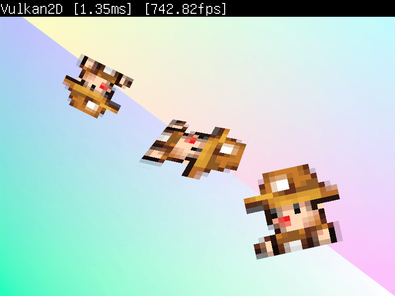
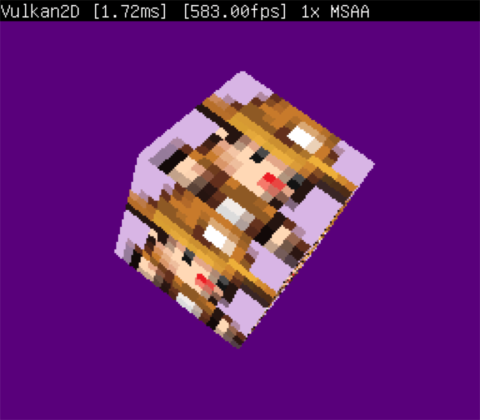

Vulkan2D
========
VK2D is a 2D renderer using Vulkan and SDL2 primarily for C games. VK2D aims for an extremely
simple API, requiring no Vulkan experience to use. [Astro](https://github.com/PaoloMazzon/Astro)
and more recently [Bedlam](https://github.com/PaoloMazzon/Bedlam) internally use Vulkan2D for
rendering. My other projects [Spacelink](https://github.com/PaoloMazzon/Spacelink) and
[Peace & Liberty](https://github.com/PaoloMazzon/PeacenLiberty) also used Vulkan2D, although
a much older version of it. Check out the [quick-start](docs/QuickStart.md) guide.

Features
========

 + Simple and intuitive API built on top of SDL
 + Draw shapes/textures/3D models/arbitrary polygons to the screen or other textures
 + Fast, built with Vulkan 1.2 and doesn't require any device features (but it can make use of some)
 + Simple and fully-featured cameras, allowing for multiple concurrent cameras
 + Powerful and very simple shader interface
 + Simple access to the Vulkan implementation through `VK2D/VulkanInterface.h`

Documentation
=============
Every file in VK2D is properly documented for doxygen, run `doxygen` in `Vulkan2D/` and an html
folder will be created containing the documentation.

Usage
=====
There are two parts to building it with your project: you must build VK2D and also VMA since
VK2D needs VMA to function. You'll likely need to do something like this in CMake:

    set(VMA_FILES VK2D/VulkanMemoryAllocator/src/vk_mem_alloc.h VK2D/VulkanMemoryAllocator/src/VmaUsage.cpp)
    file(GLOB VK2D_FILES VK2D/VK2D/*.c)
    ...
    include_directories(... Vulkan2D/ tinyobjloader-c VulkanMemoryAllocator/src/)
    add_executable(... ${VK2D_FILES} ${VMA_FILES})
   
You also need to link/include SDL2 and Vulkan but that will not be covered here as there are 
great guides elsewhere. Feel free to use the included CMakeLists.txt as a starting point.

Example
=======
Using the renderer is quite simple, but there are some things to be aware of. For the sake
of brevity, error checking is removed from the following example

    SDL_Window *window = SDL_CreateWindow("VK2D", SDL_WINDOWPOS_CENTERED, SDL_WINDOWPOS_CENTERED, WINDOW_WIDTH, WINDOW_HEIGHT, SDL_WINDOW_VULKAN);
   	SDL_Event e;
   	VK2DRendererConfig config = {VK2D_MSAA_32X, VK2D_SCREEN_MODE_TRIPLE_BUFFER, VK2D_FILTER_TYPE_NEAREST};
    vk2dRendererInit(window, config, NULL);
    vec4 clearColour;
    vk2dColourHex(clearColour, "#59d9d7");
    bool stopRunning = false;
    
    // Load your resources
    
   	while (!stopRunning) {
   		while (SDL_PollEvent(&e))
   			if (e.type == SDL_QUIT)
   				stopRunning = true;
    
   		vk2dRendererStartFrame(clearColour);
   		
   		// Draw your things
   		
   		vk2dRendererEndFrame();
   	}
    
   	vk2dRendererWait();
   	
   	// Free your resources
   	
   	vk2dRendererQuit();
   	SDL_DestroyWindow(window);

And that's about all you need. You can freely manipulate the window, if Vulkan2D detects
a window change the renderer will automatically adjust. Check the examples in `examples/`
for full examples you can compile.

TODO
====

 + 3D shaders