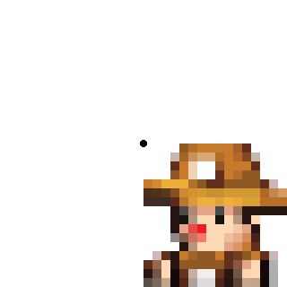
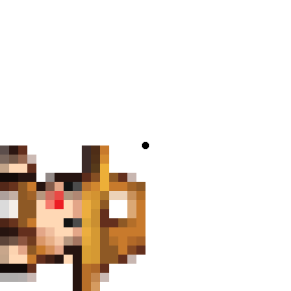

# Vulkan2D Quickstart
Vulkan2D (VK2D) is a 2D/3D renderer written in C with Vulkan for small 2D games. It is
simple enough to use, but of course there is this guide to help with some of the details.

## The Basics
Everything that will be mentioned in this guide is mentioned in greater detail in the
documentation for any given function. Feel free to generate the doxygen docs or simply
read the header file containing the function for more information. The functions of
interest to the average user will be `vk2dRenderer*`, `vk2dTexture*`, `vk2dPolygon*`,
`vk2dCamera*`, `vk2dModel*`, and `vk2dShader*`.

/a/das/d/asd TODO - talk about the renderer and state management as well as coordinate space

Controlling the renderer is quite simple and only requires a few things:

 + Initialize it at the start of your program with `vk2dRendererInit`
 + Call `vk2dRendererStartFrame` each frame before you start drawing
 + Call `vk2dRendererEndFrame` at the end of each frame to finish drawing that frame
 + Once your program is done, use `vk2dRendererQuit` (but make sure to call `vk2dRendererWait` before freeing any VK2D resources)

Outside of those basics, there is a lot you can do with the renderer. Here are some of
the more interesting functions with a basic explanation:

 + `vk2dRendererSetConfig` lets you change renderer configuration whenever you want
 + `vk2dRendererSetBlendMode` will change the current blend mode letting you do cool effects
 like lighting
 + `vk2dRendererSetColourMod` changes the colour modifier which is applied to most drawing
 functions, you could set something like `[1, 0.5, 0.5, 1]` to make everything more red
 + `vk2dRendererGetAverageFrameTime` returns the average amount of time taken between start
 and end of each frame
 + `vk2dRendererGetLimits` returns a structure containing information on what the user's
 machine is capable of

## Drawing

Drawing in VK2D is done through the renderer, the draw functions at the time of writing are

 + `vk2dRendererDrawRectangle` - Draws filled rectangles with the current render colour modifier
 + `vk2dRendererDrawRectangleOutline` - Draws rectangle outlines with the current render colour modifier
 + `vk2dRendererDrawCircle` - Draws filled circles with the current render colour modifier
 + `vk2dRendererDrawCircleOutline` - Draws circle outlines with the current render colour modifier
 + `vk2dRendererDrawLine` - Draws a line with the current render colour modifier
 + `vk2dRendererDrawTexture` - Draws a texture
 + `vk2dRendererDrawShader` - Draws a texture using a user-provided shader
 + `vk2dRendererDrawPolygon` - Draws a polygon
 + `vk2dRendererDrawModel` - Draws a 3D model

They all also have some macros to make them a little less cumbersome to use. Check the documentation for
more details on each one, as only some of the FAQ stuff will be covered here.

In VK2D, coordinates start at the top-left of the screen and go left-to-right.

In effect, something drawn with a y-value of 300 will be further down the display than something drawn with
a y-value of 100. This means the y-axis is opposite to how you might be used to it in math - it will make
more sense when you start working with it. The x-axis is "normal" though.

Rotation is always done with radians in VK2D and all rotation follow the same pattern:

All rotations start from what would be East on a compass and go clockwise. In addition, a texture/rectangle
origin of 0/0 represents the top-left corner just like screen space. This means that if you were to take a
texture such as

and rotate by half of pi, you would get

(It moved to the side.)

If you were to set the origin to half of the texture's width and height, you would instead get

Notice how it rotated in place instead of moving to the side.

By default, circle's origins are at their center, however. 3D models play by completely different rules
defined by your models and however your 3D cameras are set up.

## Textures
TODO - Talk about texture coordinate space and render targets
## Polygons
## Cameras
Cameras are a way to look into the game world with lots of powerful features. You may create up to a certain
number of cameras yourself, and by default the renderer will render to all of them at once to allow for things
like mini-maps or split-screen (see the split-screen example in `examples/` for implementation details). You
may also use `vk2dRendererLockCameras` to force the renderer to only render to a specific camera.

The first camera is always reserved for the renderer, you may refer to it as `VK2D_DEFAULT_CAMERA` and while you
may update it, its recommended to leave it for UI drawing because it will be changed by the renderer without
warning whenever the window is resized.

To create and use a camera, you need a camera specification (`VK2DCameraSpec`) and camera index (`VK2DCameraIndex`).
The spec is how you provide the renderer with the data it needs to render your world, and the index is how you
keep track of the cameras you make. Most of the spec parameters are simple and well documented, we will use some
examples will be used.

In the images below the black border represents what part of the game world the camera is viewing.

Cameras simply view a portion of the game world. You may do things like rotate the camera, zoom in, and move it.

The 4 fields, `xOnScreen`, `yOnScreen`, `wOnScreen`, and `hOnScreen` control the viewport for the camera. This means
`xOnScreen` and `yOnScreen` controls the x and y position in the game window where the camera will be displayed from
and `wOnScreen` and `hOnScreen` controls the width and height of the camera in the game window. `wOnScreen` and 
`hOnScreen` are completely independent from the cameras `w` and `h` variables; you may have a camera with `w` and `h`
much smaller than `wOnScreen` and `hOnScreen`, in fact the example in `examples/retrolook` does exactly that.

## Models
## Shaders