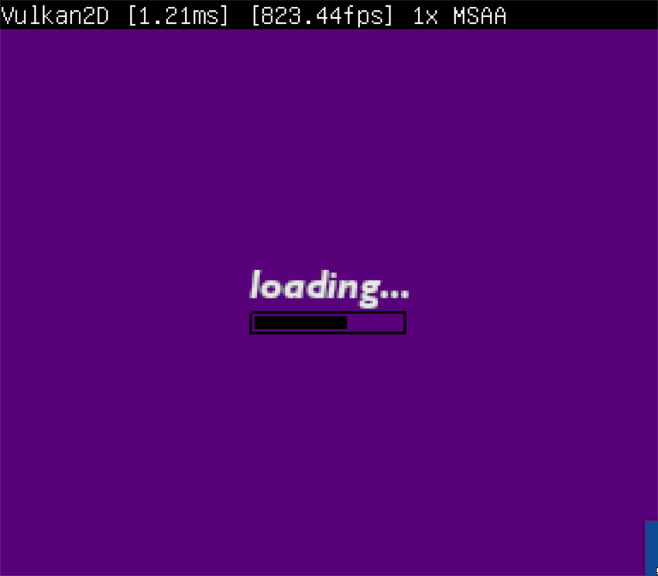

This example loads some assets in the background with `vk2dAssetsLoad`, then loads
some things in the foreground and will display a loading screen until 
`vk2dAssetsLoadComplete` returns true. `vk2dAssetsLoadStatus` is used to display a
loading bar. In the above gif the load list was artificially inflated for the load 
to take long enough to record a gif.