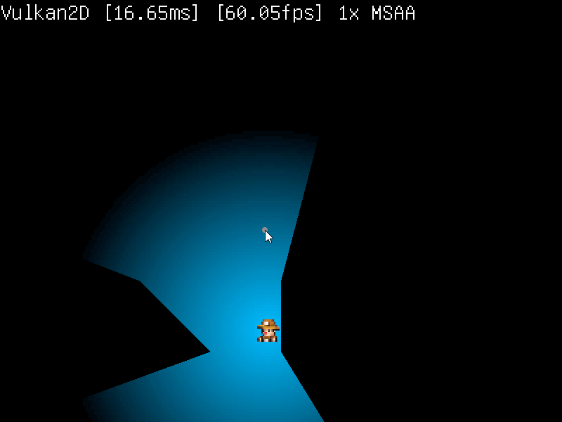

This demo is a very basic 2D light/shadows implementation using some hard-coded
polygons. It does this in a few steps:

 + A list containing every vertex of every polygon (and the corners of the
   level) is generated, we'll call it vertex list `A`
 + Another vertex list `B` is made to store all the vertices that will be generated
   from the player's field of view
 + Two texture targets are created, `U` and `V` 
 + Each vertex in `A` is sorted by their angle from the player so they are clockwise
   down the list
 + For each vertex in `A`, a ray is cast at `A` and slightly to the left and right of
   it
 + Wherever those rays land is stored as `dl`, `d`, and `dr`. Using those three ray
   landing spots from each vertex in `A` (effectively another vertex list), a list
   of triangles is assembled into `B`
 + Texture target `U` is filled with black, and using the subtract blend mode, we draw
   the triangle list in `A` to remove the player's field of view from the black
 + Texture target `V` is also filled with black and has a small light texture subtracted
   from it and drawn on top of `U`